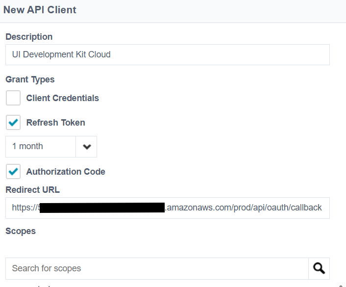

# UI Development Kit

<a id="readme-top"></a>

<!-- PROJECT SHIELDS -->

![Issues][issues-shield]
![Contributor Shield][contributor-shield]

[issues-shield]:https://img.shields.io/github/issues/sailpoint-oss/ui-development-kit?label=Issues
[contributor-shield]:https://img.shields.io/github/contributors/sailpoint-oss/ui-development-kit?label=Contributors

<!-- PROJECT LOGO -->
<br />
<div align="center">
  <a href="https://github.com/sailpoint-oss/ui-development-kit">
    
  </a>

  <h3 align="center">SailPoint UI Development Kit</h3>

  <p align="center">
    A desktop application development kit for building SailPoint Identity Security Cloud integrations
    <br />
    <a href="https://github.com/sailpoint-oss/ui-development-kit/issues/new?assignees=&labels=bug&projects=&template=bug-report.md&title=%5BBUG%5D+Your+Bug+Report+Here">Report Bug</a>
    ·
    <a href="https://github.com/sailpoint-oss/ui-development-kit/issues/new?assignees=&labels=enhancement&projects=&template=feature-request.md&title=%5BFEATURE%5D+Your+Feature+Request+Here+">Request Feature</a>
  </p>
</div>

## Table of Contents

- [About the Project](#about-the-project)
  - [Angular](#angular)
  - [Electron](#electron)
  - [Key Features](#key-features)
- [Getting Started](#getting-started)
  - [Prerequisites](#prerequisites)
  - [Installation](#installation)
  - [Local Development](#local-development)
- [Building the SailPoint SDK](#building-the-sailpoint-sdk)
- [Building the Application](#building-the-application)
  - [Docker Deployment](#docker-deployment)
  - [Deploying to AWS with GitHub Actions](#deploying-to-aws-with-github-actions)
- [Usage](#usage)
  - [Environment Configuration](#environment-configuration)
  - [Authentication Methods](#authentication-methods)
- [Contributing](#contributing)
- [License](#license)
- [Support](#support)

<!-- ABOUT THE PROJECT -->
## About the Project

The UI Development Kit is a comprehensive template for building desktop applications that integrate with SailPoint Identity Security Cloud. Built on Angular and Electron, it provides a solid foundation for creating cross-platform desktop applications with modern web technologies.

<p align="right">(<a href="#readme-top">back to top</a>)</p>

### Angular

This project is built with **Angular 19**, leveraging the latest features and improvements of the Angular framework. Angular provides:

- Component-based architecture for maintainable code
- TypeScript support for enhanced development experience
- Angular Material for modern UI components
- Reactive programming with RxJS
- Comprehensive testing framework with Jest
- Built-in internationalization support

[Learn more about Angular](https://angular.io)

<p align="right">(<a href="#readme-top">back to top</a>)</p>

### Electron

**Electron** enables the creation of cross-platform desktop applications using web technologies. The integration provides:

- Native desktop application experience
- Cross-platform compatibility (Windows, macOS, Linux)
- System-level integrations and secure credential storage
- Offline capabilities when needed
- Native file system access

[Learn more about Electron](https://electronjs.org)

<p align="right">(<a href="#readme-top">back to top</a>)</p>

### Key Features

When you use this starter, you get several features implemented out of the box:

- **Multi-Environment Management**: Configure and switch between multiple SailPoint tenants
- **Dual Authentication Support**: 
  - OAuth 2.0 browser-based authentication
  - Personal Access Token (PAT) authentication
- **SailPoint SDK Integration**: Pre-configured with the latest SailPoint API client
- **Cross-Platform Desktop Build**: Ready-to-build for Windows, macOS, and Linux
- **Modern UI Framework**: Angular Material components for consistent UX
- **TypeScript Support**: Full TypeScript integration for enhanced development
- **Secure Credential Storage**: Uses system keychain for secure credential management
- **Environment Validation**: Built-in OAuth endpoint validation
- **Developer Tools**: ESLint, Jest testing, and Playwright e2e testing

<p align="right">(<a href="#readme-top">back to top</a>)</p>

## Getting Started

### Prerequisites

To use this development kit, you must have Node.js and npm installed. 

- **Node.js**: Version 16.14.0 or higher, or 18.10.0 or higher
- **npm**: Comes bundled with Node.js

You can download Node.js from [nodejs.org](https://nodejs.org/).

### Installation

1. Clone the repository:
   ```bash
   git clone https://github.com/sailpoint-oss/ui-development-kit.git
   cd ui-development-kit
   ```

2. Install dependencies:
   ```bash
   npm install
   ```

3. Build the component library:
   ```bash
   npm run build:components
   ```

<p align="right">(<a href="#readme-top">back to top</a>)</p>

### Local Development (Electron)

To start the application in development mode:

```bash
npm run start
```

This command will:
1. Start the Angular development server
2. Launch the Electron application
3. Enable hot reload for rapid development

### Local Development (Web)

#### Getting your OAuth Token:
1. Log into your ISC instance and navigate to Global -> Security Settings
2. Click on "API Management" and add a new API like the following:



Record the client id and secret for use in deploying and running locally for authentication purposes (shown below)

#### For web-only local development of the angular app:
```bash
npm run ng:serve:web
```
in the `/server` directory:
Ensure you have a .env file with the following variables set:
```yaml
# Server Configuration
PORT=3000
SESSION_SECRET=your-secure-session-secret

# SailPoint OAuth Configuration
TENANT_URL=https://beta-orgId.identitynow-demo.com/
API_URL=https://beta-orgId.api.identitynow-demo.com/
CLIENT_ID=YourClientId
CLIENT_SECRET=YourClientSecret
REDIRECT_URI=http://localhost:3000/api/oauth/callback
OAUTH_SCOPES=sp:scopes:all
```

And run the command
```bash
npm run start
```

<p align="right">(<a href="#readme-top">back to top</a>)</p>

## Building and updating the SailPoint SDK

To update the SailPoint SDK follow the steps below: 

1. locate the sailpoint-api-client in both the app/package.json and the package.json file at the root of the project and update the version to the latest version you would like to use.

2. Run `npm install` in both the app folder and the root of the project to install the SDK in both locations where it is used.

3. Create the autogenerated files using the `npm run build:sdk` command. Note that this command requires java installed to run properly.


Nothing else needs to be done, but in case you want to generate the files manually, you can use the steps below:

1. Download the OpenAPI Generator CLI (version 7.11+):
   ```bash
   wget https://repo1.maven.org/maven2/org/openapitools/openapi-generator-cli/7.11.0/openapi-generator-cli-7.11.0.jar
   ```

2. Clone the API specifications:
   ```bash
   git clone https://github.com/sailpoint-oss/api-specs.git
   ```

3. Run the pre-script to prepare the specifications:
   ```bash
   node ./mustache_templates/prescript.js api-specs/idn/v2025/paths
   ```

4. Generate the SDK:
   ```bash
   java -jar openapi-generator-cli-7.11.0.jar generate  -i api-specs/idn/sailpoint-api.v2025.yaml -g typescript-axios  --global-property skipFormModel=false  --config generator-config.yaml  --api-name-suffix V2025Api  --model-name-suffix V2025
   ```

<p align="right">(<a href="#readme-top">back to top</a>)</p>

### Creating a new component

To create a new component in the SailPoint components library, use the generate:component script:

```bash
npm run generate:component <component-name>
```

For example, to create a user-management component:

```bash
npm run generate:component user-management
```

This will:
1. Create component files in `projects/sailpoint-components/src/lib/<component-name>/`
2. Add the component to the component selector service
3. Update app routes to include the new component
4. Add a navigation link in the app component
5. Export the component in the public API

After generating the component, you need to:
1. Build the project: `npm run start`
2. Enable the component in the component selector
3. Implement your component logic

## Building the Application

To build the application for distribution:

### Development Build
```bash
npm run build:dev
```

### Production Build
```bash
npm run build:prod
```

### Platform-Specific Builds

| Command | Description | Platform |
| --- | --- | --- |
| `npm run electron:build` | Builds for current platform | Auto-detected |

The built application will be available in the `dist/` directory.

### Web Build
For web deployment (without Electron):
```bash
npm run web:build
```

For Docker deployment (without Electron TypeScript):
```bash
npm run docker:build
```

### Docker Deployment

The application can be deployed using Docker to any container hosting service (AWS ECS, Azure Container Instances, Google Cloud Run, DigitalOcean, Railway, Render, etc.).

#### Building the Docker Image

Build the Docker image:
```bash
docker build -t sailpoint-ui-dev-kit .
```

#### Running with Docker Compose (Recommended)

1. **Create environment file**:
   ```bash
   # Copy the example file
   cp .env.example .env
   
   # Edit .env and fill in your SailPoint credentials
   # Get OAuth credentials from: Global -> Security Settings -> API Management
   ```

2. **Start the application**:
   ```bash
   docker-compose up -d
   ```

3. **View logs**:
   ```bash
   docker-compose logs -f
   ```

4. **Stop the application**:
   ```bash
   docker-compose down
   ```

The application will be available at `http://localhost:3000`

#### Running with Docker CLI

```bash
docker run -d \
  -p 3000:3000 \
  -e JWT_SECRET="your-jwt-secret" \
  -e SESSION_SECRET="your-session-secret" \
  -e TENANT_URL="https://your-org.identitynow.com/" \
  -e CLIENT_ID="your-client-id" \
  -e CLIENT_SECRET="your-client-secret" \
  -e REDIRECT_URI="http://localhost:3000/api/oauth/callback" \
  -e OAUTH_SCOPES="sp:scopes:all" \
  --name sailpoint-ui-dev-kit \
  sailpoint-ui-dev-kit
```

#### Environment Variables

| Variable | Description | Required | Default |
|----------|-------------|----------|---------|
| `PORT` | Server port | No | `3000` |
| `NODE_ENV` | Environment mode | No | `production` |
| `JWT_SECRET` | JWT signing secret | Yes | - |
| `SESSION_SECRET` | Session encryption secret | Yes | - |
| `TENANT_URL` | SailPoint tenant URL | Yes | - |
| `CLIENT_ID` | OAuth client ID | Yes | - |
| `CLIENT_SECRET` | OAuth client secret | Yes | - |
| `REDIRECT_URI` | OAuth redirect URI | Yes | - |
| `OAUTH_SCOPES` | OAuth scopes | No | `sp:scopes:all` |
| `WEBSITE_URL` | Website URL for CORS | No | `http://localhost:3000` |

#### Deploying to Cloud Services

**AWS ECS/Fargate**:
```bash
# Push to ECR
aws ecr get-login-password --region us-east-1 | docker login --username AWS --password-stdin <account-id>.dkr.ecr.us-east-1.amazonaws.com
docker tag sailpoint-ui-dev-kit:latest <account-id>.dkr.ecr.us-east-1.amazonaws.com/sailpoint-ui-dev-kit:latest
docker push <account-id>.dkr.ecr.us-east-1.amazonaws.com/sailpoint-ui-dev-kit:latest
```

**Google Cloud Run**:
```bash
# Push to GCR
gcloud builds submit --tag gcr.io/<project-id>/sailpoint-ui-dev-kit
gcloud run deploy sailpoint-ui-dev-kit --image gcr.io/<project-id>/sailpoint-ui-dev-kit --platform managed
```

**Azure Container Instances**:
```bash
# Push to ACR
az acr login --name <registry-name>
docker tag sailpoint-ui-dev-kit <registry-name>.azurecr.io/sailpoint-ui-dev-kit
docker push <registry-name>.azurecr.io/sailpoint-ui-dev-kit
az container create --resource-group <group> --name sailpoint-ui-dev-kit --image <registry-name>.azurecr.io/sailpoint-ui-dev-kit
```

**Railway/Render**: Connect your Git repository and they will automatically detect and build the Dockerfile.

### Deploying to AWS with GitHub Actions

The application can be deployed to AWS using the included GitHub Actions workflow (`.github/workflows/aws-deploy.yml`). The workflow automatically deploys both the Angular frontend and Node.js backend to AWS infrastructure.

#### Prerequisites

Before using the GitHub Action to deploy, you need to set up the following in your AWS and GitHub environments:

##### 1. AWS Infrastructure Setup

**AWS OIDC Provider for GitHub Actions**
- Configure an OIDC identity provider in AWS IAM to allow GitHub Actions to authenticate without storing AWS credentials
- Create an IAM role with the following trust policy:
  ```json
  {
    "Version": "2012-10-17",
    "Statement": [
      {
        "Effect": "Allow",
        "Principal": {
          "Federated": "arn:aws:iam::{ACCOUNT_ID}:oidc-provider/token.actions.githubusercontent.com"
        },
        "Action": "sts:AssumeRoleWithWebIdentity",
        "Condition": {
          "StringEquals": {
            "token.actions.githubusercontent.com:aud": "sts.amazonaws.com"
          },
          "StringLike": {
            "token.actions.githubusercontent.com:sub": "repo:{ORG}/{REPO}:*"
          }
        }
      }
    ]
  }
  ```
- Attach the following AWS managed policies to the role:
  - `AWSCloudFormationFullAccess`
  - `IAMFullAccess`
  - `AmazonS3FullAccess`
  - `CloudFrontFullAccess`
  - `AmazonDynamoDBFullAccess`
  - `AWSLambda_FullAccess`
  - `AmazonAPIGatewayAdministrator`

**Note**: The workflow references `arn:aws:iam::176038645705:role/github-action-role` - update this in the workflow file with your own AWS account ID and role name.

##### 2. GitHub Secrets Configuration

Configure the following secrets in your GitHub repository (Settings → Secrets and variables → Actions):

| Secret Name | Description | Required | Example |
|------------|-------------|----------|---------|
| `JWT_SECRET` | Secret key for JWT token signing and session encryption | Yes | A long random string (min 32 characters) |
| `TENANT_URL` | Your SailPoint tenant URL | Yes | `https://your-org.identitynow.com/` |
| `CLIENT_ID` | OAuth client ID from SailPoint | Yes | From ISC API Management settings |
| `CLIENT_SECRET` | OAuth client secret from SailPoint | Yes | From ISC API Management settings |
| `REDIRECT_URI` | OAuth redirect URI (will be `{API_URL}/oauth/callback`) | Yes | `https://your-api.com/oauth/callback` |
| `OAUTH_SCOPES` | OAuth scopes to request | No | Defaults to `sp:scopes:all` |

**Getting OAuth Credentials**: Follow the instructions in the [Local Development (Web)](#local-development-web) section to create an OAuth client in SailPoint.

##### 3. SAM CLI Configuration

The workflow uses AWS SAM (Serverless Application Model) to deploy infrastructure. The following resources are created automatically:
- **Lambda Function**: Node.js backend API
- **API Gateway**: HTTP API with CORS configuration
- **DynamoDB Table**: Session and token storage (table name: `{stack-name}-sessions`)
- **S3 Bucket**: Static website hosting for Angular frontend
- **CloudFront Distribution**: CDN for the frontend


##### 4. Deployment Workflow

**Main Branch Deployment**:
- Pushes to the `main` branch automatically deploy to the production stack (`ui-dev-kit`)
- The workflow ignores changes to `README.md` and `docs/**` files

**Pull Request Deployments**:
- Each pull request gets its own preview deployment stack (`ui-dev-kit-pr-{number}`)
- A comment is added to the PR with deployment URLs
- Preview stacks are automatically cleaned up when the PR is closed

**Manual Deployment**:
- Use the "Actions" tab in GitHub and select "Run workflow" to manually trigger a deployment

##### 5. Deployment Process

The GitHub Action performs the following steps:
1. Builds the Node.js backend TypeScript code
2. Deploys AWS infrastructure using SAM CLI (Lambda, API Gateway, DynamoDB, S3, CloudFront)
3. Updates Angular environment files with the deployed API URL
4. Builds the Angular application for production
5. Uploads the built frontend to S3
6. Updates API Gateway CORS settings with the CloudFront URL
7. Updates Lambda environment variables with OAuth configuration
8. Invalidates CloudFront cache to serve the new version

##### 6. Post-Deployment

After successful deployment, the workflow outputs:
- **Web Application URL**: CloudFront distribution URL for accessing the app
- **API Endpoint URL**: API Gateway URL for backend services
- **Stack Name**: CloudFormation stack name for reference

For pull requests, these URLs are automatically posted as a comment on the PR.

<p align="right">(<a href="#readme-top">back to top</a>)</p>

## Usage

### Environment Configuration

1. **Launch the Application**: Start the development kit using `npm start`

2. **Configure Environments**: 
   - Click the settings icon to open environment configuration
   - Add multiple SailPoint tenant configurations
   - Each environment includes:
     - Tenant name and URLs
     - Authentication method preference
     - Secure credential storage

3. **Switch Environments**: Use the dropdown to switch between configured environments

### Authentication Methods

#### Personal Access Token (PAT)
- Requires Client ID and Client Secret
- Stored securely in system keychain
- Suitable for automation and headless scenarios

#### OAuth 2.0
- Browser-based authentication flow
- More secure for interactive use
- Automatic token refresh
- Built-in endpoint validation

<p align="right">(<a href="#readme-top">back to top</a>)</p>

## Contributing

Contributions are what make the open-source community such an amazing place to learn, inspire, and create. Any contributions you make are **greatly appreciated**.

If you have a suggestion to improve this project, please fork the repo and create a pull request. You can also make a suggestion by opening an issue with the tag `enhancement`.

1. Fork the Project
2. Create your Feature Branch (`git checkout -b feature/AmazingFeature`)
3. Commit your Changes (`git commit -m 'Add some AmazingFeature'`)
4. Push to the Branch (`git push origin feature/AmazingFeature`)
5. Open a Pull Request

### Development Guidelines

- Follow the existing code style and patterns
- Add tests for new functionality
- Update documentation as needed
- Run linting before submitting: `npm run lint`
- Run tests: `npm test`

<p align="right">(<a href="#readme-top">back to top</a>)</p>

## License

Distributed under the MIT License. See `LICENSE.txt` for more information.

<p align="right">(<a href="#readme-top">back to top</a>)</p>

## Support

You can discuss this tool and get support from the community:

- [SailPoint Developer Community Forum](https://developer.sailpoint.com/discuss/)
- [GitHub Issues](https://github.com/sailpoint-oss/ui-development-kit/issues) for bug reports and feature requests
- [SailPoint Developer Documentation](https://developer.sailpoint.com/docs/)

<p align="right">(<a href="#readme-top">back to top</a>)</p>